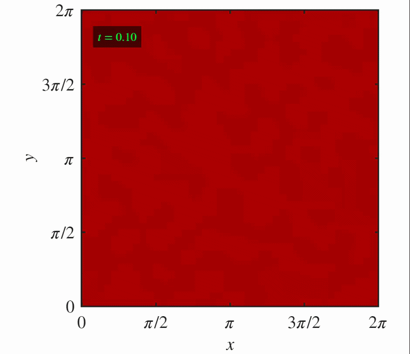
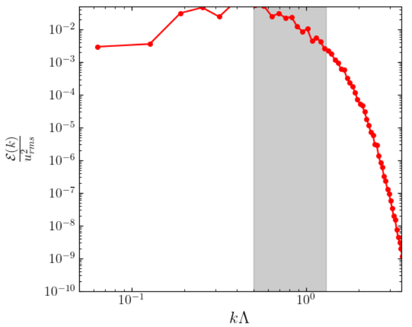

# 2D Active Turbulence Simulator (TTSH Hydrodynamics)

This repository contains a high-performance, native MATLAB solver designed to simulate two-dimensional active fluid turbulence on a high-resolution $1024 \times 1024$ periodic mesh. The solver models the hydrodynamic evolution of active matter (such as dense bacterial suspensions or ATP-driven micro-tubule networks) using a pseudo-spectral formulation of the Toner-Tu-Swift-Hohenberg (TTSH) model.

---

## 🚀 Governing Equations

The system tracks the evolution of the scalar vorticity field $\Omega = \nabla \times \mathbf{u}$ over a doubly-periodic domain $\mathcal{D} = [0, 2\pi]^2$. The governing partial differential equation partitions the dynamics into a linear operator $\mathcal{L}$ and a structural cubic nonlinear operator $\mathcal{N}$:

$$\frac{\partial \Omega}{\partial t} = \mathcal{L}\Omega + \mathcal{N}(\Omega)$$

### 1. Linear Activity Operator
The linear term $\mathcal{L}$ captures large-scale friction, intermediate-scale energy injection (negative viscosity driving active rings/vortices), and sub-grid hyperviscous damping:

$$\mathcal{L} = -\alpha - \Gamma_2 \nabla^2 - \Gamma_4 \nabla^4$$

Where:
* $\alpha$: Rayleigh friction coefficient (large-scale energy sink).
* $\Gamma_2$: Negative viscosity coefficient ($\Gamma_2 > 0$ serves as the primary energy pump).
* $\Gamma_4$: Hyperviscosity damping coefficient (prevents ultraviolet numerical blowup).

### 2. Nonlinear Hydrodynamic Stresses
The nonlinear operator $\mathcal{N}(\Omega)$ accounts for broken Galilean invariance via a modified advection strength $\lambda_0$ and active multi-scale drag forces parametrized by $\beta$:

$$\mathcal{N}(\Omega) = -\lambda_0 \left( \mathbf{u} \cdot \nabla \right) \Omega - \beta \nabla \times \left( |\mathbf{u}|^2 \mathbf{u} \right)$$

The velocity vector field $\mathbf{u} = (u, v)$ is reconstructed in Fourier space from the streamfunction $\psi$ via the standard inversion of the Laplacian:

$$\nabla^2 \psi = \Omega \quad \implies \quad u = \frac{\partial \psi}{\partial y}, \quad v = -\frac{\partial \psi}{\partial x}$$

---

## 🛠️ Numerical Methodology

The solver leverages a fully dealiased pseudo-spectral space discretization coupled with an explicit exponential time-integration loop:

* **Spatial Discretization:** Space derivatives are evaluated in Fourier space via Fast Fourier Transforms (FFTs) utilizing a $1024 \times 1024$ uniform grid.
* **Dealiasing Protocol:** To eliminate high-frequency aliasing errors stemming from the cubic nonlinearity, a strict **1/2 dealiasing rule** is applied globally at every evaluation stage:
    $$\mathcal{M}(\mathbf{k}) = \begin{cases} 1, & \text{if } |k_x| \le \frac{N_x}{4} \text{ and } |k_y| \le \frac{N_y}{4} \\ 0, & \text{otherwise} \end{cases}$$
* **Time Integration:** A 4th-order **Integrating Factor Runge-Kutta (IF-RK4)** scheme treats the linear stiff hyperviscous operators exactly using exponential integrating factors, enabling stable time steps of $\Delta t = 0.002$.

---

## 📊 Simulation Visualization

Below is the side-by-side presentation showcasing the evolved fluid field animation along with its corresponding quantitative analysis:

<table>
  <tr>
    <td align="center" width="50%">
      
<b>Active Turbulence Simulation (Vorticity Contour Map)</b>

      
      
<em>Click the animation to view the full GIF.</em>

    </td>
    <td align="center" width="50%">
      
<b>Kinetic Energy Spectrum</b>

      
    </td>
  </tr>
</table>

## Author
Aritra Roy

